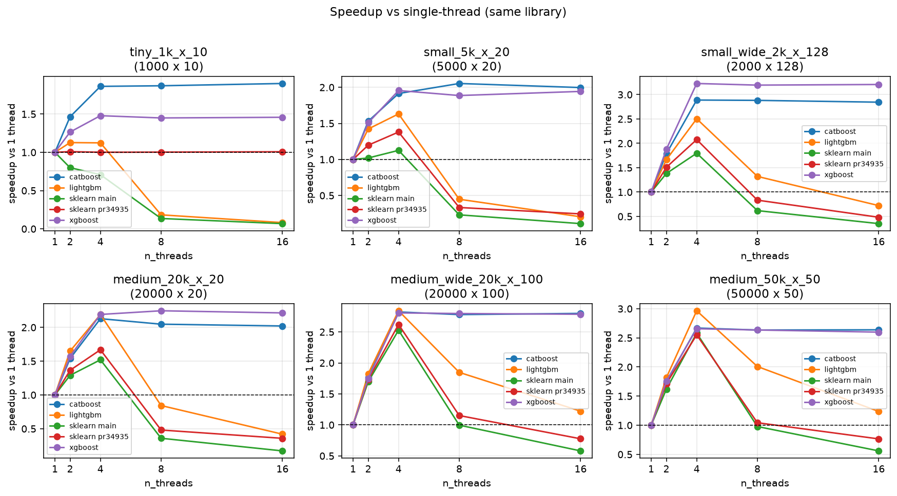

# HGB OpenMP scalability: PR 34935 vs `main` vs XGBoost / LightGBM / CatBoost

This run compares `HistGradientBoostingClassifier` on
[scikit-learn/scikit-learn#34935](https://github.com/scikit-learn/scikit-learn/pull/34935)
(`hgb/active_wait` @ `6ea3ffac5c`) to sklearn `main` @ `af6b2ded95`, and to
XGBoost 3.4.1, LightGBM 4.7.0 and CatBoost 1.2.10 with approximately matching
hyperparameters.

## Why this comparison

On sklearn `main`, HGB uses all available OpenMP threads for tree growth. That
is expensive on **small and medium** problems: thread-start / join overhead
and (with libgomp active wait) idle-thread spinning dominate the actual split
work. PR 34935 caps threads from `n_samples` and `n_features`, and is stricter
when OpenMP is not using active wait.

The goal here is not a 64-core scaling curve. It is to check:

1. Does the PR stop the `main` collapse when too many OpenMP threads are
   requested on small/medium data?
2. How does that compare to XGBoost / LightGBM / CatBoost at matched HPs
   (fit time **and** held-out ROC AUC)?

## Hardware and OpenMP

| Item | Value |
| --- | --- |
| Host | 4 vCPU KVM Intel Xeon (family 6 model 207), 1 socket, no SMT |
| Python | 3.12.3, GCC 13.3.0, sklearn built with OpenMP (`libgomp`) |
| `OMP_NUM_THREADS` | 32 (so sklearn may exceed `cpu_count()`) |
| `OMP_WAIT_POLICY` | unset (libgomp **active wait**; PR reports `openmp_active_wait=true`) |
| BLAS | OpenBLAS, `MKL_NUM_THREADS=OPENBLAS_NUM_THREADS=1` |
| Timing | 1 warmup + 2 timed `fit`s; median wall time |
| Test metric | binary ROC AUC on a 50% hold-out (`n_test = n_train`); not in the timer |

**Limitation:** this VM has 4 cores. Thread counts 8 and 16 **oversubscribe**.
That is harsher than using 16 threads on a 16-core box, but it is a fair proxy
for “sklearn `main` honors a large default `OMP_NUM_THREADS` on a small
problem,” which is the failure mode on big machines.

## Matched hyperparameters

All libraries: 40 trees, `max_leaf_nodes` / `num_leaves` / `max_leaves` = 31,
learning rate 0.1, `max_bin` = 255, binary log-loss, no early stopping,
`random_state=0`. Data from `make_classification` (`float32`).

Known mismatches (same as `get_equivalent_estimator` plus CatBoost
lossguide):

- XGBoost: `tree_method=hist`, `grow_policy=lossguide`, `max_depth=0`,
  `min_child_weight=1e-3`, `reg_lambda=0`.
- LightGBM: `min_data_in_leaf=20`, `min_sum_hessian_in_leaf=1e-3`,
  `force_row_wise=True`.
- CatBoost: `grow_policy=Lossguide`, `depth=16`, `l2_leaf_reg=3` (0 is
  rejected), `bootstrap_type=No`, `boosting_type=Plain`. CatBoost is therefore
  not a tight HP match.

## Fit time (s) and test ROC AUC

Each cell is `fit seconds / ROC AUC`. AUC is measured on a held-out half of
`make_classification` after the timed `fit`. For sklearn, XGBoost and
LightGBM it does not change with thread count (same trees). CatBoost moves by
at most ~0.001 except as noted.

| shape | threads | sklearn main | sklearn PR | XGBoost | LightGBM | CatBoost |
| --- | ---: | ---: | ---: | ---: | ---: | ---: |
| tiny 1k×10 | 1 | 0.045 / 0.958 | 0.040 / 0.958 | 0.060 / 0.961 | **0.023** / 0.961 | 0.173 / 0.965 |
| tiny 1k×10 | 4 | 0.064 / 0.958 | 0.040 / 0.958 | 0.041 / 0.961 | **0.020** / 0.961 | 0.093 / 0.965 |
| tiny 1k×10 | 16 | 0.658 / 0.958 | **0.040** / 0.958 | 0.041 / 0.961 | 0.277 / 0.961 | 0.091 / 0.965 |
| small 5k×20 | 1 | 0.091 / 0.984 | 0.088 / 0.984 | 0.145 / 0.984 | **0.076** / 0.985 | 0.409 / 0.982 |
| small 5k×20 | 4 | 0.081 / 0.984 | 0.064 / 0.984 | 0.074 / 0.984 | **0.047** / 0.985 | 0.213 / 0.982 |
| small 5k×20 | 16 | 0.828 / 0.984 | 0.359 / 0.984 | **0.074** / 0.984 | 0.372 / 0.985 | 0.205 / 0.982 |
| small-wide 2k×128 | 4 | 0.182 / 0.936 | 0.153 / 0.936 | 0.274 / 0.943 | **0.130** / 0.940 | 0.835 / 0.906 |
| small-wide 2k×128 | 16 | 0.925 / 0.936 | 0.656 / 0.936 | **0.276** / 0.943 | 0.449 / 0.940 | 0.848 / 0.906 |
| medium 20k×20 | 4 | 0.102 / 0.985 | 0.093 / 0.985 | 0.099 / 0.985 | **0.076** / 0.985 | 0.281 / 0.985 |
| medium 20k×20 | 16 | 0.900 / 0.985 | 0.433 / 0.985 | **0.098** / 0.985 | 0.398 / 0.985 | 0.296 / 0.985 |
| medium-wide 20k×100 | 4 | 0.255 / 0.969 | **0.247** / 0.969 | 0.381 / 0.970 | 0.284 / 0.970 | 0.875 / 0.964 |
| medium-wide 20k×100 | 16 | 1.108 / 0.969 | 0.833 / 0.969 | **0.384** / 0.970 | 0.661 / 0.970 | 0.882 / 0.964 |
| medium 50k×50 | 4 | 0.235 / 0.969 | **0.235** / 0.969 | 0.327 / 0.971 | 0.277 / 0.969 | 0.693 / 0.969 |
| medium 50k×50 | 16 | 1.084 / 0.969 | 0.784 / 0.969 | **0.334** / 0.971 | 0.664 / 0.969 | 0.701 / 0.969 |

Pivots: `fit_seconds_pivot.csv`, `test_roc_auc_pivot.csv`. Raw: `results.csv`.

sklearn `main` and PR 34935 produce **identical** test AUC on every shape
(the thread cap does not change the trees). XGBoost and LightGBM are within
about 0.007 of sklearn. CatBoost is in the same band except **small-wide
2k×128** (0.906 vs sklearn 0.936), consistent with the looser HP match
(`l2_leaf_reg=3`, `depth=16`).




## Findings

### 1. sklearn `main` mishandles surplus OpenMP threads on small/medium data

On every shape, `main` is best at 2–4 threads (the physical core count) and
then **slows down** as threads go to 8 and 16:

- tiny 1k×10: 0.045 s @ 1 thread → **0.658 s @ 16 threads** (~15× slower).
- small 5k×20: 0.081 s @ 4 → **0.828 s @ 16** (~10× slower).
- medium 50k×50: 0.235 s @ 4 → **1.08 s @ 16** (~4.6× slower).

That is the same qualitative bug as “default OMP on a many-core CPU” for a
problem that cannot feed that many workers.

### 2. PR 34935 removes the tiny-data collapse and is never worse in the oversubscribed regime

With active wait, the PR uses 1 thread when `n_samples * n_features <= 20_000`.
The tiny 1k×10 task is **exactly** in that bucket (`10_000`), so the PR stays
at **~0.040 s for 1, 2, 4, 8, and 16 requested threads**. Versus `main` at 16
threads that is a **~17×** speedup. Test AUC stays 0.958, matching `main`.

On larger shapes the heuristic still uses multiple threads, so 8/16 still
oversubscribe this 4-core VM and both sklearn builds slow down. The PR remains
faster than `main` in that regime (about **1.3–2.1×** at 16 threads).

At the physical default of **4 threads**, the PR is equal or slightly faster
than `main` on every shape.

Single-thread times of `main` and the PR match to a few percent on medium
shapes, so the Cython work is not slower; the difference is thread policy.

### 3. Other libraries already cap or tolerate extra threads better than sklearn `main`

- **XGBoost** is the most robust to surplus threads: after 4 cores, fit time
  is flat (tiny: ~0.041 s; medium 50k×50: ~0.33 s from 4 through 16).
  On oversubscribed small/medium problems it is the fastest library here.
  Test AUC matches sklearn to ~0.002–0.007.
- **LightGBM** is the fastest at 1–4 threads on the small/narrow tasks, but
  **also collapses** on tiny/small data at 8–16 threads (tiny 0.020 s @ 4 →
  0.277 s @ 16), similar in kind to sklearn `main`, just less severe.
  Test AUC is within ~0.004 of sklearn.
- **CatBoost** is slower in absolute time (lossguide + default L2), but its
  time is essentially flat from 4 to 16 threads: it does not keep adding
  harmful workers the way `main` does. AUC is comparable except on 2k×128.

At a sane thread count (4 on this machine) sklearn HGB is **competitive**:
tied/fastest of the five on medium-wide 20k×100 and medium 50k×50 (PR 0.247 s
and 0.235 s). LightGBM wins the small/narrow cases. CatBoost is 2–4× slower.

### 4. What this does *not* show

- Scaling from 8 to 32 **physical** cores on a large dataset. The PR claims
  HGB still scales to 16–32 threads when there is enough work and active wait
  is on; this 4-vCPU box cannot test that.
- Passive wait (`OMP_WAIT_POLICY=PASSIVE`, conda-forge default). The PR is
  more conservative in that mode (`min_workload=2e6`, cap of 4 threads below
  2e7 elements). That path was not measured here.
- `OMP_PROC_BIND=close`.

## How to rerun

```bash
# two worktrees: sklearn main and PR 34935
export PATH=/path/to/venv/bin:$PATH CC=gcc CXX=g++
bash benchmarks/run_hgb_omp_scalability.sh
```

Optional: `--threads 1,2,4,8,16` and `--shapes tiny_1k_x_10,...` are forwarded
if you invoke the Python script directly.

This pull request includes code written with the assistance of AI.
The code has **not yet been reviewed** by a human.
