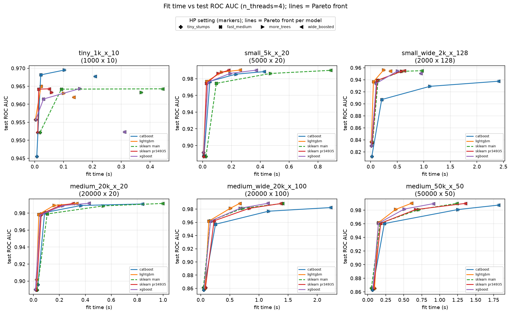
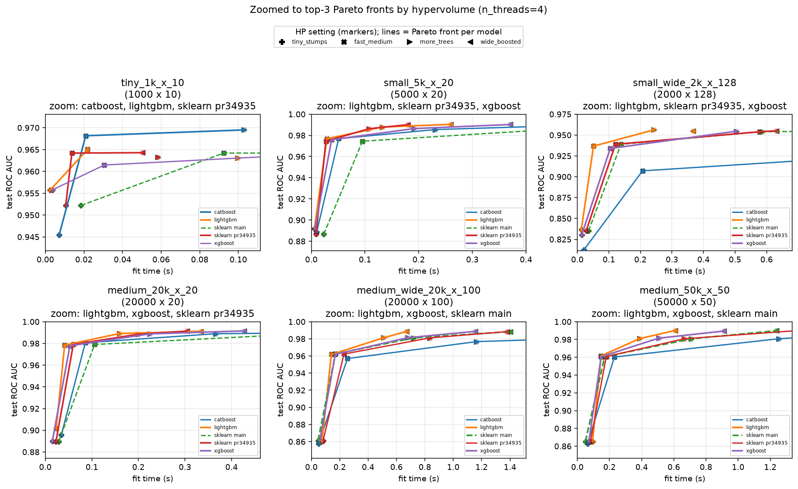
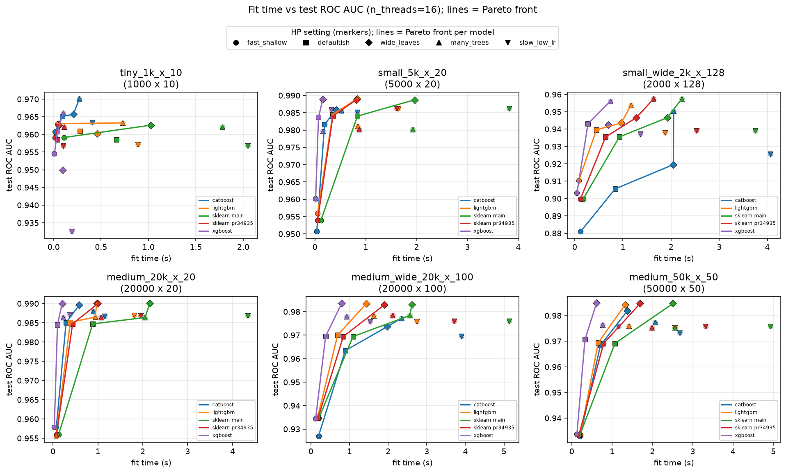
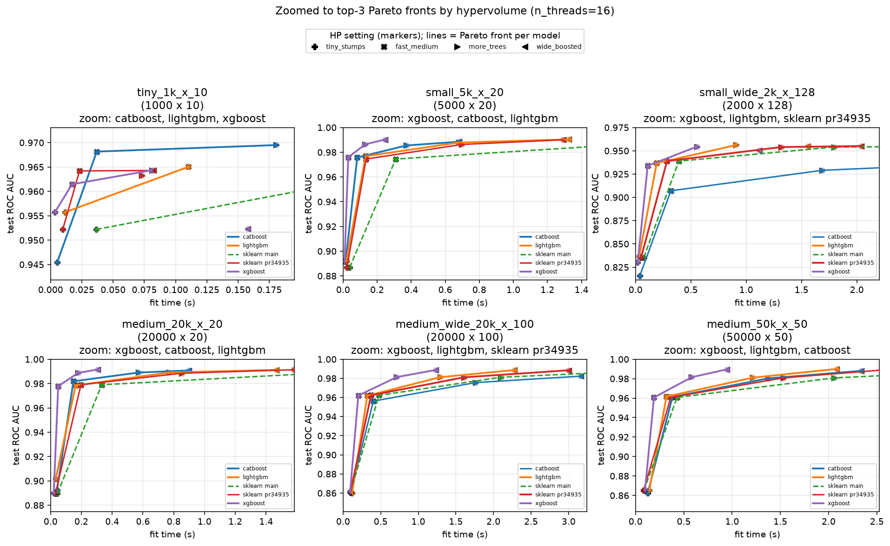
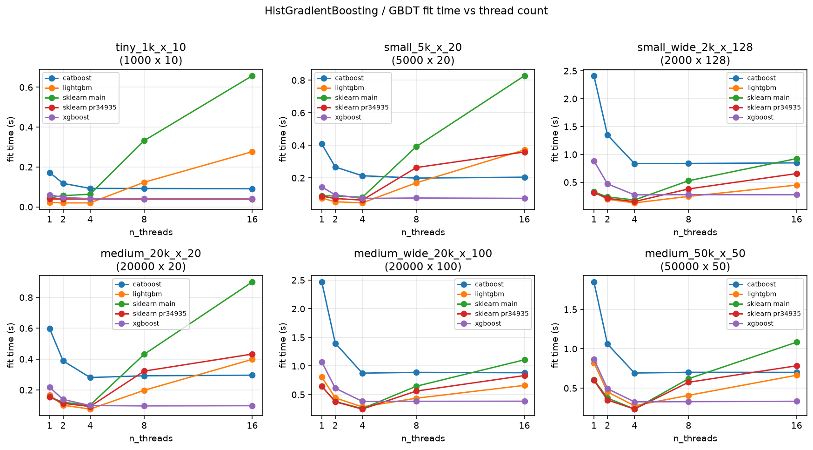

# HGB OpenMP scalability: PR 34935 vs `main` vs XGBoost / LightGBM / CatBoost

This run compares `HistGradientBoostingClassifier` on
[scikit-learn/scikit-learn#34935](https://github.com/scikit-learn/scikit-learn/pull/34935)
(`hgb/active_wait` @ `6ea3ffac5c`) to sklearn `main` @ `af6b2ded95`, and to
XGBoost 3.4.1, LightGBM 4.7.0 and CatBoost 1.2.10.

Each library is run with **nine matched hyperparameter settings** (early
stopping off), denser on the cheap-to-accurate side of the GBDT tradeoff.
For every dataset we plot **fit time vs held-out ROC AUC**, the **Pareto
front** per model, and a **zoom** to the smallest window that contains the
three fronts with largest 2D hypervolume.

## Hardware and OpenMP

| Item | Value |
| --- | --- |
| Host | 4 vCPU KVM Intel Xeon, 1 socket, no SMT |
| sklearn | built with OpenMP (`libgomp`), active wait |
| `OMP_NUM_THREADS` | 32 |
| Threads measured | **4** (physical cores) and **16** (surplus / oversubscription) |
| BLAS | 1 thread |
| Timing | 1 warmup + 1 timed `fit` |
| Test metric | binary ROC AUC on a 50% hold-out (`n_test = n_train`) |

## Matched hyperparameter grid

| `hp_name` | `n_estimators` | `max_leaf_nodes` | `learning_rate` |
| --- | ---: | ---: | ---: |
| `tiny_stumps` | 10 | 4 | 0.5 |
| `fast_shallow` | 20 | 8 | 0.3 |
| `fast_medium` | 30 | 15 | 0.2 |
| `defaultish` | 40 | 31 | 0.1 |
| `more_trees` | 80 | 31 | 0.08 |
| `wide_leaves` | 50 | 63 | 0.1 |
| `wide_boosted` | 80 | 63 | 0.1 |
| `many_shallow` | 120 | 8 | 0.1 |
| `many_trees` | 200 | 15 | 0.05 |

Shared: `max_bin=255`, binary log-loss, `early_stopping=False`,
`random_state=0`. CatBoost still uses `l2_leaf_reg=3`, `depth=16`,
`grow_policy=Lossguide` (`max_leaves` is capped at 64 by CatBoost, hence 63
rather than 127).

## Fit time vs ROC AUC (Pareto)

Markers are HP settings; **lines are the Pareto front** of that model
(maximize AUC, minimize fit time). sklearn `main` is dashed so it remains
visible when it overlaps the PR.

The **zoom** plots clip large fit times: for each panel the x/y limits are the
smallest box that still contains the **top-3 Pareto fronts** (ranked by 2D
hypervolume). Dominated slow HPs (and sklearn `main` at 16 threads) fall
outside that window.

### 4 threads (physical cores)





- **sklearn `main` and PR 34935 overlap**: same AUC for every HP, fit times
  within a few percent. The thread-cap heuristic does not change the trees.
- **`tiny_stumps` / `fast_shallow` / `fast_medium`** fill the left of the
  front. LightGBM is usually cheapest; sklearn is close on medium/wide data.
- **`wide_leaves` / `wide_boosted` / `more_trees`** occupy the high-AUC
  corner (~0.98–0.99 on the larger sets). `many_trees` is often dominated.
- **CatBoost** is slower at matched HPs. On tiny data it can sit slightly
  above the others in AUC; on 2k×128 it lags both in time and AUC.

### 16 threads (surplus OpenMP)





Same AUCs as at 4 threads. What moves is **fit time**:

- **sklearn `main` shifts right** — same quality, much more time — so it
  drops out of the top-3 zoom on most panels.
- **PR 34935 stays put on tiny data** (heuristic pins tiny problems to 1
  thread) and otherwise oversubscribes less than `main`, so **its front
  dominates `main`**.
- **XGBoost** fronts barely move and often own the 16-thread zoom.
- **LightGBM** slows on tiny/small data (but less than `main`).
- **CatBoost** is almost unchanged from 4 to 16 threads.

## Thread scaling at `defaultish` (40 / 31 / 0.1)



| shape | threads | sklearn main | sklearn PR | XGBoost | LightGBM | CatBoost | AUC (sklearn) |
| --- | ---: | ---: | ---: | ---: | ---: | ---: | ---: |
| tiny 1k×10 | 4 | 0.058 | 0.039 | 0.042 | **0.021** | 0.094 | 0.958 |
| tiny 1k×10 | 16 | 0.665 | **0.039** | 0.042 | 0.289 | 0.093 | 0.958 |
| small 5k×20 | 4 | 0.079 | 0.066 | 0.069 | **0.043** | 0.191 | 0.984 |
| small 5k×20 | 16 | 0.876 | 0.353 | **0.069** | 0.343 | 0.193 | 0.984 |
| medium 50k×50 | 4 | 0.232 | **0.231** | 0.344 | 0.283 | 0.710 | 0.969 |
| medium 50k×50 | 16 | 1.074 | 0.799 | **0.332** | 0.661 | 0.715 | 0.969 |

AUC is identical for sklearn `main` and the PR at every HP. XGBoost/LightGBM
stay within ~0.007 of sklearn except CatBoost on 2k×128.

# How to rerun

The supported way is the pixi workspace next to this report (compilers,
OpenMP, XGBoost / LightGBM / CatBoost, and both sklearn trees):

```bash
# https://pixi.sh/
cd benchmarks/hgb_omp_scalability
pixi install
pixi run bench
```

See `benchmarks/hgb_omp_scalability/README.md` for `THREADS`,
`OMP_WAIT_POLICY` (`pixi run -e active-wait` / `passive-wait`), and
forwarding extra argparse flags.

Without pixi, from a env that already has the GBDT libraries and two
editable sklearn builds:

```bash
export SKLEARN_MAIN=/path/to/sklearn-main SKLEARN_PR=/path/to/pr34935
bash benchmarks/run_hgb_omp_scalability.sh
```

This pull request includes code written with the assistance of AI.
The code has **not yet been reviewed** by a human.
