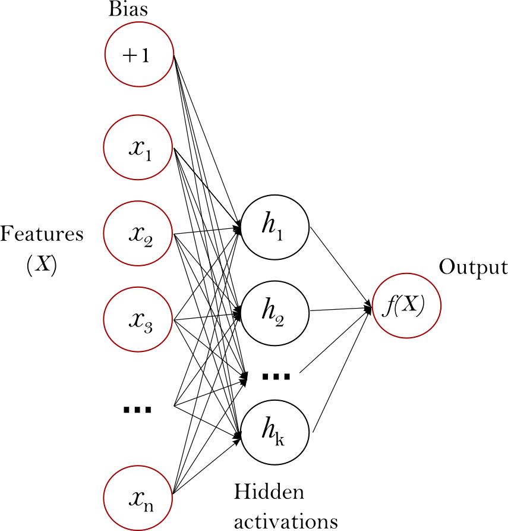

.. _neural_network:

==================================
Neural network models (supervised)
==================================

.. currentmodule:: sklearn.neural_network

.. _elm:

Extreme Learning Machines
=========================

**Extreme Learning Machine (ELM)** is a supervised nonlinear learning 
algorithm that takes the following consecutive steps for training:

  *  it applies a random projection to the input space, onto a possibly higher 
     dimensional space;
  *  the result passes through an element-wise non-linear activation function,
     typically a sigmoid such as the tanh, and logistic functions; and
  *  last, it trains a linear one vs. rest classifier or a multi-output ridge 
     regression model.

ELMs can be considered as single-hidden layer feedforward neural networks 
(see figure 1) where:

  *  they train only the hidden-to-output connection weights;
  *  assign random values, as constants, to the input-to-hidden connection 
     weights; and
  *  minimize the loss function using least squares.

In several empirical studies, ELM was found to have a generalization performance 
similar to that of a one hidden layer multi-layer perceptron (MLP) or radial
basis function (RBF) kernel support vector machines while being significantly 
faster to train.

     Figure 1 : Single-hidden layer feedforward network.

ELM has three main hyper-parameters,

  *  `weight_scale`: controls the variance of the random projection weights;
  *  `n_hidden`: controls the number of hidden layer nodes; and
  *  `C`: controls the regularization strength of the output linear model.

`weight_scale` and `C` are similar in that they regularize weight parameters
such that a higher value means less regularization hence less underfitting (or less bias)
but potentially more overfitting (or more variance). However, in terms of their
effect on the single-hidden layer feedforward network, `weight_scale` regularizes 
the input-to-hidden connection weights, whereas `C` regularizes the hidden-to-output 
connection weights. Some examples demonstrating the effect of these two parameters are listed
below::

.. figure:: ../auto_examples/neural_networks/images/plot_elm_scale_C_and_weight_scale_001.png
   :target: ../auto_examples/neural_networks/plot_elm_scale_C_and_weight_scale.html
   :align: center
   :scale: 100%

.. topic:: Examples:

   * :ref:`example_neural_networks_plot_elm_scale_C_and_weight_scale.py`

.. figure:: ../auto_examples/neural_networks/images/plot_elm_hyperparameters_001.png
   :target: ../auto_examples/neural_networks/plot_elm_hyperparameters.html
   :align: center
   :scale: 100%

.. topic:: Examples:

   * :ref:`example_neural_networks_plot_elm_hyperparameters.py`

Higher `n_hidden` provides ELM with a higher capacity to learn complex 
functions. It allows ELM to have more feature detectors in the hidden 
layer that characterize the training dataset. 

This implements :ref:`classification <elm_classification>` for classification 
and :ref:`regression <elm_regression>` for regression. They support both dense
(``numpy.ndarray`` and convertible to that by ``numpy.asarray``) and
sparse (any ``scipy.sparse``) sample vectors as input. They also support
on-line and batch-based training.

.. _elm_classification:

Classification
==============

:class:`ELMClassifier` supports binary-class, multi-class, and
multi-label classification on datasets.

Like other classifiers, :class:`ELMClassifier` trains on a dataset using the
fit method that accepts two input parameters: an array X of size 
``(n_samples, n_features)``, which represents the training samples, and an array y 
of integer values of size ``(n_samples)``, which holds the class labels respective
to the training samples::

    >>> from sklearn.neural_network import ELMClassifier
    >>> X = [[0, 0], [1, 1]]
    >>> y = [0, 1]
    >>> clf = ELMClassifier(random_state=1)
    >>> clf.fit(X, y)
    ELMClassifier(C=1, activation='tanh', batch_size=None, class_weight=None,
           n_hidden=500, random_state=1, verbose=False, warm_start=False,
           weight_scale=1.0)

After training, the model can predict the class of a new sample::

    >>> clf.predict([[2., 2.]])
    array([1])

Weighted classification
-----------------------

For imbalanced datasets, giving more weight to classes having less samples than 
others could help improve accuracy. 

:class:`ELMClassifier` has the parameter ``class_weight`` in
its ``fit`` method that can be set either to ``None`` - where no weight is
given to any class; ``auto`` - where weight is given to a sample based
on its class distribution in the dataset; and a dictionary of the form
``{class_label : class_weight}``.

Figure 2 shows the result of adding weight to the minority class, where the 
decision boundary surrounding that class becomes larger in radius as more weight is given.

.. figure:: ../auto_examples/neural_networks/images/plot_weighted_elm_001.png
   :target: ../auto_examples/neural_networks/plot_weighted_elm.html
   :align: center
   :scale: 100%

   Figure 2 : Effect of sample weighting on an imbalanced dataset.

.. topic:: Examples:

   * :ref:`example_neural_networks_plot_weighted_elm.py`
 

.. _elm_regression:

Regression
==========

:class:`ELMRegressor` can solve regression problems consisting of one or more
output values assigned to each sample. It differs from :class:`ELMClassifier`, 
in that the final output is a continuous value.

The fit method in :class:`ELMRegressor` accepts arguments X and y
where y is expected to be a matrix of floating point values::

    >>> from sklearn.neural_network import ELMRegressor
    >>> X = [[0, 0], [2, 2]]
    >>> y = [0.5, 2.5]
    >>> clf = ELMRegressor(random_state=1)
    >>> clf.fit(X, y)
    ELMRegressor(C=1000000.0, activation='tanh', batch_size=None, n_hidden=100,
           random_state=1, verbose=False, warm_start=False, weight_scale=1.0)

    >>> clf.predict([[1, 1]])
    array([ 1.59733482])

.. _elm_tips:

Tips on Practical Use
=====================

  * **Setting C**: if the dataset has few samples or if the samples are noisy, 
    decreasing ``C`` will increase regularization which in turn reduces 
    overfitting and might improve generalization. Increasing ``C`` will 
    therefore decrease regularization.

  * **Setting class_weight**: if the dataset contains an imbalanced ratio 
    of class fequencies, it is desirable to set `class_weight='auto'`, as
    it assigns more weight to the class having less number of samples.

  * **Setting weight_scale**:  this controls regularization of the weights 
    the same way as ``C`` does; but instead of regularizing the hidden-to-output 
    layer weights, it regularizes the input-to-hidden layer weights.

Mathematical formulation
========================

A standard ELM with ``kernel='random'`` trains a single-hidden layer
feedforward network using the following function,

:math:`y = \beta \cdot \sigma(W^T \cdot X + b)`

where matrices ``X`` and ``y`` represent the input samples and target values, 
respectively; matrices ``W`` and ``b`` are randomly generated based on a 
uniform distribution; matrix :math:`\beta` contains unknown variables;
and :math:`\sigma` is the non-linear, component-wise activation function.

ELM solves for :math:`\beta` using the ridge regression implementation, given
as,

:math:`(H^T H + (1/C)*I)^{-1} H^T y`

where  :math:`H = \sigma(W^TX + b)`, `C` is a regularization term which controls the 
linearity of the decision function, and `I` is the identity matrix.

.. topic:: References:

 *  Huang, Guang-Bin, Qin-Yu Zhu, and Chee-Kheong Siew. 
      "Extreme learning machine: theory and applications." 
      Neurocomputing 70.1 (2006): 489-501

 *  Liang, Nan-Ying, et al.
      "A fast and accurate online sequential learning algorithm for
      feedforward networks." Neural Networks, IEEE Transactions on
      17.6 (2006): 1411-1423.
      http://www.ntu.edu.sg/home/egbhuang/pdf/OS-ELM-TNN.pdf

 *  Zong, Weiwei, Guang-Bin Huang, and Yiqiang Chen.
      "Weighted extreme learning machine for imbalance learning."
      Neurocomputing 101 (2013): 229-242.

