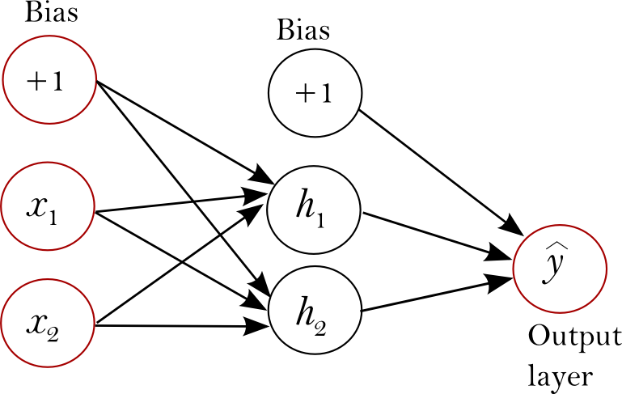
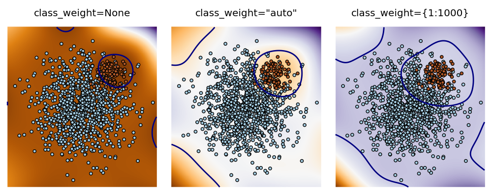

.. _neural_network:

==================================
Neural network models (supervised)
==================================

.. currentmodule:: sklearn.neural_network

.. _elm:

Extreme Learning Machines
=========================
**Extreme Learning Machine (ELM)** is a supervised nonlinear learning 
algorithm that takes the following consecutive steps for training:

  *  it applies a random projection on the input space to a possibly larger 
     dimensional space;
  *  the result passes through an element-wise non-linear activation function,
     typically a sigmoid such as the tanh, and logistic functions; and
  *  last, it trains a linear one versus all classifier or a multi-output ridge 
     regression model.

ELM can be considered as a single-hidden layer feedforward neural network 
(see figure 1) where:

  *  it trains only the hidden-to-output connection weights;
  *  assigns random values, as constants, to the input-to-hidden connection 
     weights; and
  *  minimizes the loss function using least squares.

In most empirical studies, ELM was found to have a generalization performance 
similar to that of 1 hidden layer MLPs or RBF kernel support vector
machines while being significantly faster to train.

ELM has three main hyper-parameters,

  *  `weight_scale`: controls the variance of the random projection weights;
  *  `n_hidden`: controls the number of hidden layer nodes; and
  *  `C`: controls the regularization strength of the output linear model.

     Figure 1 : Single-hidden layer feedforward network.

This implements :ref:`classification <elm_classification>` for classification 
and :ref:`regression <elm_regression>` for regression. They support both dense
(``numpy.ndarray`` and convertible to that by ``numpy.asarray``) and
sparse (any ``scipy.sparse``) sample vectors as input. They also support
real-time and batch-based training.

.. _elm_classification:

Classification
==============

:class:`ELMClassifier` supports binary-class, multi-class, and
multi-label classification on datasets.

Like other classifiers, :class:`ELMClassifier` trains on a dataset using the
fit method that accepts two input parameters: an array X of size 
``(n_samples, n_features)`` representing the training samples, and an array y 
of integer values, size ``(n_samples)``, holding the class labels respective
to the training samples::

    >>> from sklearn.neural_network import ELMClassifier
    >>> X = [[0, 0], [1, 1]]
    >>> y = [0, 1]
    >>> clf = ELMClassifier()
    >>> clf.fit(X, y)
    ELMClassifier(C=1, activation='tanh', algorithm='standard', batch_size=200,
           class_weight=None, coef0=0.0, degree=3, gamma=None, kernel='random',
           n_hidden=500, random_state=None, verbose=False, weight_scale='auto')

After training, the model can predict the class of a new sample::

    >>> clf.predict([[2., 2.]])
    array([1])

.. _elm_bin_multi_class:

Binary and multi-class classification
--------------------------------------

The network has one output neuron for binary classification, and one output
neuron per possible class for multi-class classification.

In binary classification, if the output for a sample is higher than 0, the 
sample is assigned to class 1; otherwise it is assigned to class 0.

In multi-class classification, the output for a sample passes through softmax
which returns a set of probabilities corresponding to each class. The class 
representing the highest probability becomes the class assigned to the sample.

Weighted classification
-----------------------

For datasets containing an imbalanced ratio of class frequencies, it is
important to consider adding more weight to classes having less samples than
others. 

:class:`ELMClassifier` has the parameter ``class_weight`` in
its ``fit`` method that can be set either to ``None`` - where all samples
are treated the same; ``auto`` - where weight is given to a sample based
on its class distribution in the dataset; and a dictionary of the form
``{class_label : value}`` - which assigns each sample a weight ``value``
corresponding to the sample's ``class_label``.

Figure [2] shows the result of adding weight to the orange samples - 
representing a minority class, where the decision boundary sorrounding that 
class becomes larger in radius as more weight is given.

   Figure 2 : Effect of sample weighting on an imbalanced dataset.

.. _elm_regression:

Regression
==========

:class:`ELMRegressor` can solve regression problems consisting of one or more
output values assigned to each sample. It differs from :class:`ELMClassifier`, 
in that the final output is a continuous value.

The fit method in :class:`ELMRegressor` accepts arguments X and y
where y is expected to be a matrix of floating point values::

    >>> from sklearn.neural_network import ELMRegressor
    >>> X = [[0, 0], [2, 2]]
    >>> y = [0.5, 2.5]
    >>> clf = ELMRegressor()
    >>> clf.fit(X, y)
    ELMRegressor(C=1000000.0, activation='tanh', algorithm='standard',
           batch_size=200, coef0=0.0, degree=3, gamma=None, kernel='random',
           n_hidden=100, random_state=None, verbose=False, weight_scale='auto')
    >>> clf.predict([[1, 1]])
    array([[ 1.60537537]])

Tips on Practical Use
=====================

  * **Setting `C`**: if the dataset has few samples or if the samples are noisy, 
    decreasing ``C`` will increase regularization which in turn reduces 
    overfitting and might improve generalization. 

  * **Setting `class_weight`**: if the dataset contains an imbalanced ratio 
    of class fequencies, it is desirable to assign more weight to the class 
    having less number of samples. Assuming class 1 is the minority 
    class, you can assign more weight to it by setting class_weight as, say,
    {1:100}.

  * **Setting `algorithm`**: if the dataset is of size that can fit into 
    memory then setting algorithm='standard' would be desirable. Otherwise,
    in cases where memory is limited or there is a need for real-time learning,
    it is prudent to have algorithm='recursive_lsqr'.

  * **Setting `weight_scale`**:  this controls regularization of the weights 
    the same way as `C` does; but instead of regularizing the hidden-to-output 
    layer weights, it regularizes the first-to-hidden layer weights.

.. _elm_kernels:

Kernel functions
================

The *kernel function* can be any of the following:

  * random: :math:` W^T \cdot x + b`. where `W` and `b` are randomly 
    generated matrices.

  * linear: :math:`\langle x, x'\rangle`.

  * polynomial: :math:`(\gamma \langle x, x'\rangle + r)^d`. `d` is specified by
    keyword ``degree``, `r` by ``coef0``.

  * rbf: :math:`\exp(-\gamma |x-x'|^2)`. :math:`\gamma` is
    specified by keyword ``gamma``, must be greater than 0.

  * sigmoid (:math:`\tanh(\gamma \langle x,x'\rangle + r)`), where `r` is specified by
    ``coef0``.

Different kernels are specified by keyword kernel at initialization::

    >>> elm_linear = ELMClassifier(kernel='linear')
    >>> elm_linear.kernel
    'linear'
    >>> elm_rbf = ELMClassifier(kernel='rbf')
    >>> elm_rbf.kernel
    'rbf'

Mathematical formulation
========================

A standard ELM with ``kernel='random'`` trains a single-hidden layer
feedforward network using the following function,

:math:`y = \beta (W^TX + b)`

where matrices ``X`` and ``y`` represent the input samples and target values, 
respectively; matrices ``W`` and ``b`` are randomly generated based on a 
uniform distribution; and matrix :math:`\beta` contains unknown variables.

ELM solves for :math:`\beta` using the ridge regression implementation, given
as,

:math:`(H^T H + (1/C)*I)^{-1} H^T y`

where  :math:`H = W^TX + b`, `C` is a regularization term which controls the 
linearity of the decision function, and `I` is the identity matrix.

.. topic:: References:

 *  Zong, Weiwei, Guang-Bin Huang, and Yiqiang Chen.
      "Weighted extreme learning machine for imbalance learning."
      Neurocomputing 101 (2013): 229-242.

 *  Liang, Nan-Ying, et al.
      "A fast and accurate online sequential learning algorithm for
      feedforward networks." Neural Networks, IEEE Transactions on
      17.6 (2006): 1411-1423.
      http://www.ntu.edu.sg/home/egbhuang/pdf/OS-ELM-TNN.pdf

