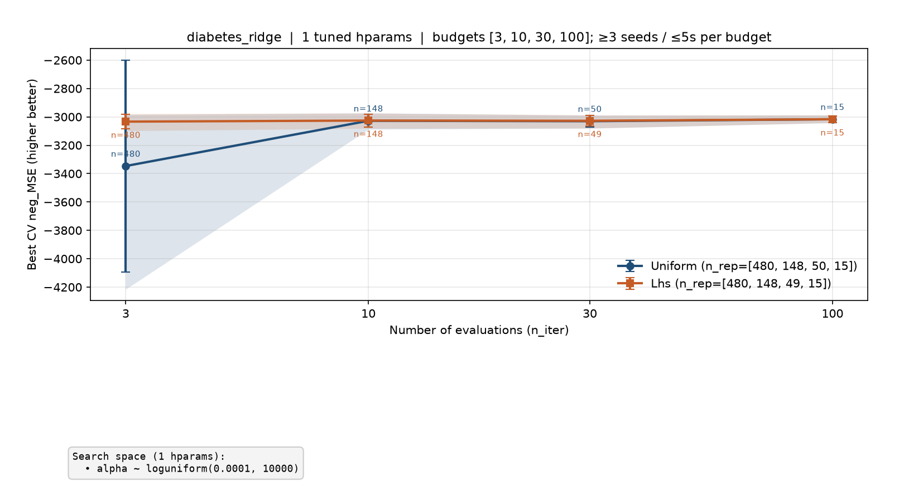
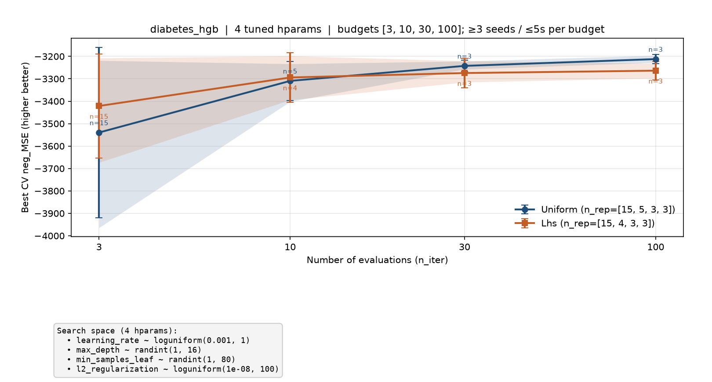
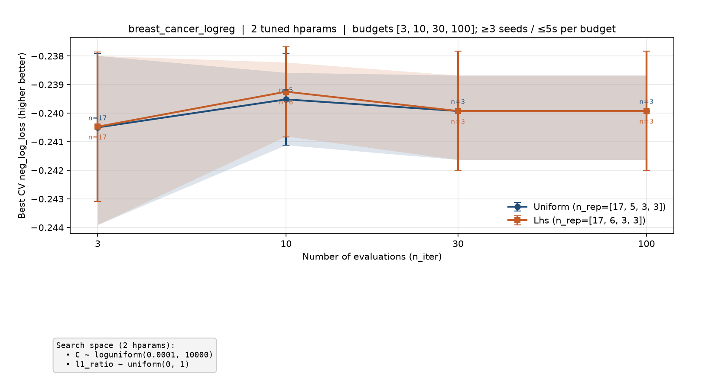
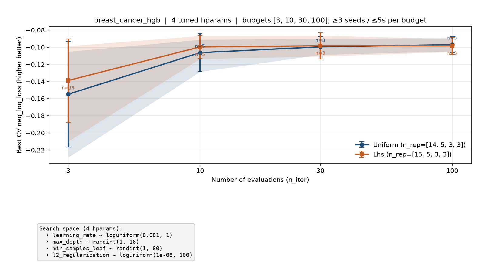
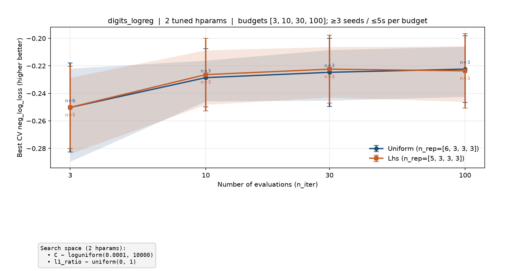
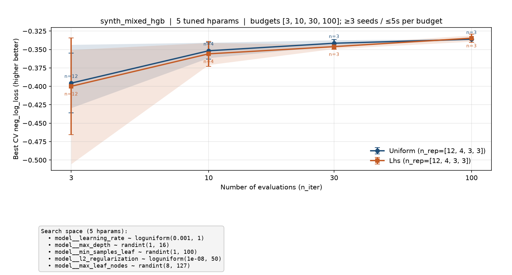
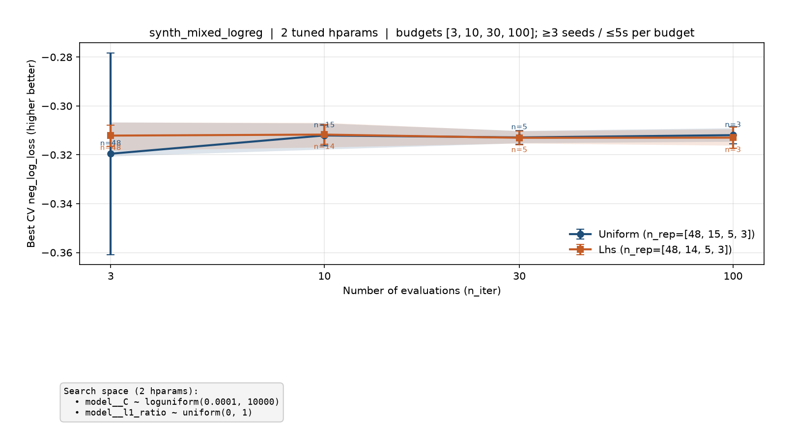
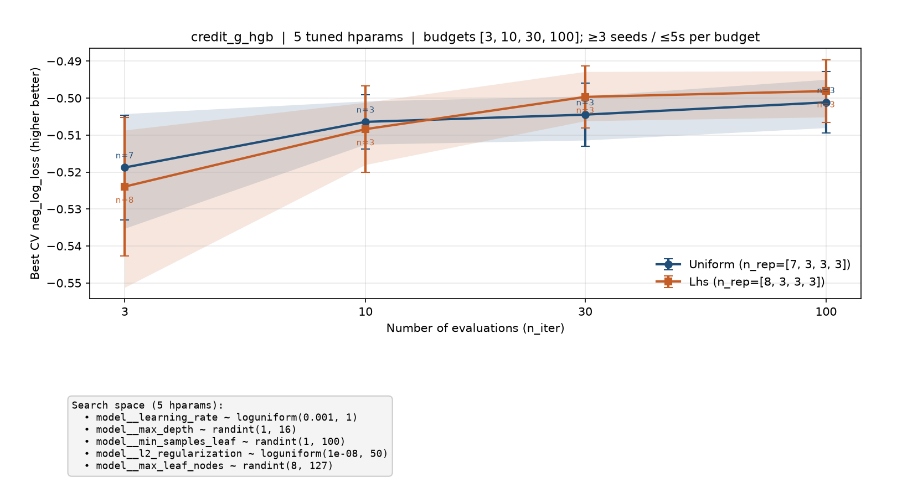

# Best score vs number of evaluations

_Generated 2026-08-19 08:37:45 UTC_

Budgets: `n_iter ∈ [3, 10, 30, 100]`. For each budget/method, as many seed repeats as fit in **5s** wall time (always **≥3** repeats). Points show mean ± std; bands are 10th–90th percentiles across seeds.

## `diabetes_ridge` — 1 tuned hparams



| n_iter | Uniform mean±std (n) | LHS mean±std (n) |
|------:|----------------------:|-----------------:|
| 3 | -3346.6±748 (n=480) | -3033.6±50.5 (n=480) |
| 10 | -3027.6±45.5 (n=148) | -3026±45.2 (n=148) |
| 30 | -3030.5±40.1 (n=50) | -3027.6±37.1 (n=49) |
| 100 | -3016.7±22.4 (n=15) | -3016.6±22.5 (n=15) |

```
alpha ~ loguniform(0.0001, 10000)
```

## `diabetes_hgb` — 4 tuned hparams



| n_iter | Uniform mean±std (n) | LHS mean±std (n) |
|------:|----------------------:|-----------------:|
| 3 | -3539.6±380 (n=15) | -3421.2±232 (n=15) |
| 10 | -3309.4±87.3 (n=5) | -3294.1±111 (n=4) |
| 30 | -3242.4±25.4 (n=3) | -3274.3±65.5 (n=3) |
| 100 | -3212.1±19.9 (n=3) | -3263.7±41.4 (n=3) |

```
learning_rate ~ loguniform(0.001, 1)
max_depth ~ randint(1, 16)
min_samples_leaf ~ randint(1, 80)
l2_regularization ~ loguniform(1e-08, 100)
```

## `breast_cancer_logreg` — 2 tuned hparams



| n_iter | Uniform mean±std (n) | LHS mean±std (n) |
|------:|----------------------:|-----------------:|
| 3 | -0.2405±0.0026 (n=17) | -0.24047±0.00262 (n=17) |
| 10 | -0.23952±0.0016 (n=5) | -0.23925±0.00158 (n=6) |
| 30 | -0.23992±0.00209 (n=3) | -0.23992±0.00209 (n=3) |
| 100 | -0.23992±0.00209 (n=3) | -0.23992±0.00209 (n=3) |

```
C ~ loguniform(0.0001, 10000)
l1_ratio ~ uniform(0, 1)
```

## `breast_cancer_hgb` — 4 tuned hparams



| n_iter | Uniform mean±std (n) | LHS mean±std (n) |
|------:|----------------------:|-----------------:|
| 3 | -0.15484±0.0618 (n=14) | -0.13884±0.0488 (n=15) |
| 10 | -0.10637±0.0222 (n=5) | -0.099651±0.0133 (n=5) |
| 30 | -0.099571±0.0118 (n=3) | -0.098318±0.0153 (n=3) |
| 100 | -0.097014±0.0097 (n=3) | -0.09846±0.00983 (n=3) |

```
learning_rate ~ loguniform(0.001, 1)
max_depth ~ randint(1, 16)
min_samples_leaf ~ randint(1, 80)
l2_regularization ~ loguniform(1e-08, 100)
```

## `digits_logreg` — 2 tuned hparams



| n_iter | Uniform mean±std (n) | LHS mean±std (n) |
|------:|----------------------:|-----------------:|
| 3 | -0.25023±0.0325 (n=6) | -0.25015±0.0299 (n=5) |
| 10 | -0.22856±0.0212 (n=3) | -0.22636±0.0263 (n=3) |
| 30 | -0.22469±0.0248 (n=3) | -0.2224±0.0248 (n=3) |
| 100 | -0.22236±0.0242 (n=3) | -0.22363±0.0271 (n=3) |

```
C ~ loguniform(0.0001, 10000)
l1_ratio ~ uniform(0, 1)
```

## `synth_mixed_hgb` — 5 tuned hparams



| n_iter | Uniform mean±std (n) | LHS mean±std (n) |
|------:|----------------------:|-----------------:|
| 3 | -0.3956±0.0405 (n=12) | -0.39991±0.0657 (n=12) |
| 10 | -0.35173±0.0114 (n=4) | -0.35589±0.0169 (n=4) |
| 30 | -0.34153±0.00501 (n=3) | -0.34616±0.00366 (n=3) |
| 100 | -0.3361±0.000607 (n=3) | -0.33461±0.00562 (n=3) |

```
model__learning_rate ~ loguniform(0.001, 1)
model__max_depth ~ randint(1, 16)
model__min_samples_leaf ~ randint(1, 100)
model__l2_regularization ~ loguniform(1e-08, 50)
model__max_leaf_nodes ~ randint(8, 127)
```

## `synth_mixed_logreg` — 2 tuned hparams



| n_iter | Uniform mean±std (n) | LHS mean±std (n) |
|------:|----------------------:|-----------------:|
| 3 | -0.31955±0.0413 (n=48) | -0.31213±0.00434 (n=48) |
| 10 | -0.31207±0.00418 (n=15) | -0.31172±0.00399 (n=14) |
| 30 | -0.31289±0.00277 (n=5) | -0.31304±0.00283 (n=5) |
| 100 | -0.31195±0.00353 (n=3) | -0.31298±0.00427 (n=3) |

```
model__C ~ loguniform(0.0001, 10000)
model__l1_ratio ~ uniform(0, 1)
```

## `credit_g_hgb` — 5 tuned hparams



| n_iter | Uniform mean±std (n) | LHS mean±std (n) |
|------:|----------------------:|-----------------:|
| 3 | -0.51877±0.0142 (n=7) | -0.52394±0.0187 (n=8) |
| 10 | -0.50643±0.00738 (n=3) | -0.5084±0.0117 (n=3) |
| 30 | -0.50447±0.00852 (n=3) | -0.49967±0.00836 (n=3) |
| 100 | -0.50116±0.0083 (n=3) | -0.49811±0.00853 (n=3) |

```
model__learning_rate ~ loguniform(0.001, 1)
model__max_depth ~ randint(1, 16)
model__min_samples_leaf ~ randint(1, 100)
model__l2_regularization ~ loguniform(1e-08, 50)
model__max_leaf_nodes ~ randint(8, 127)
```

This pull request includes code written with the assistance of AI.
The code has **not yet been reviewed** by a human.
