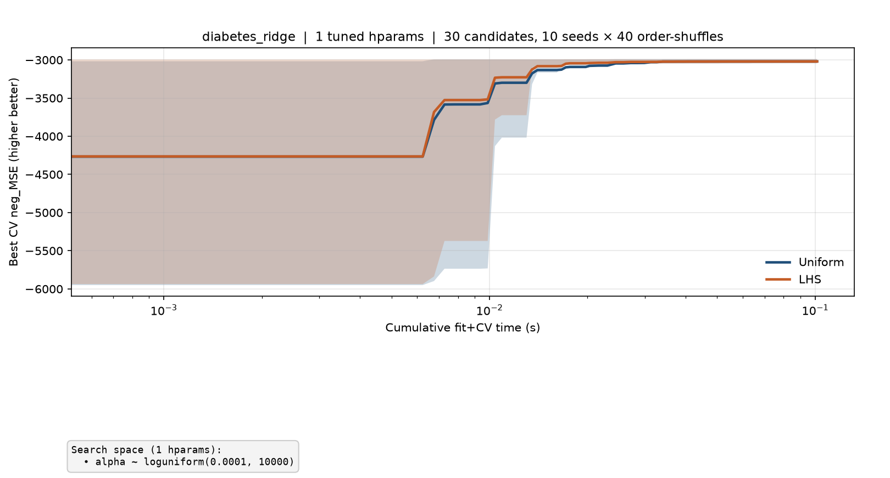
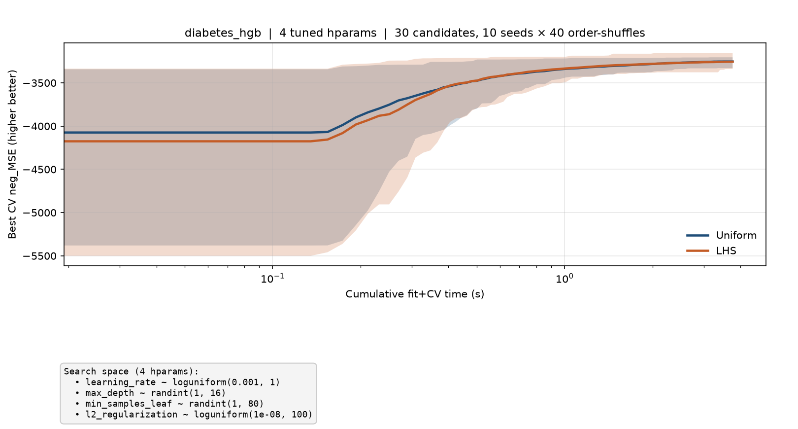
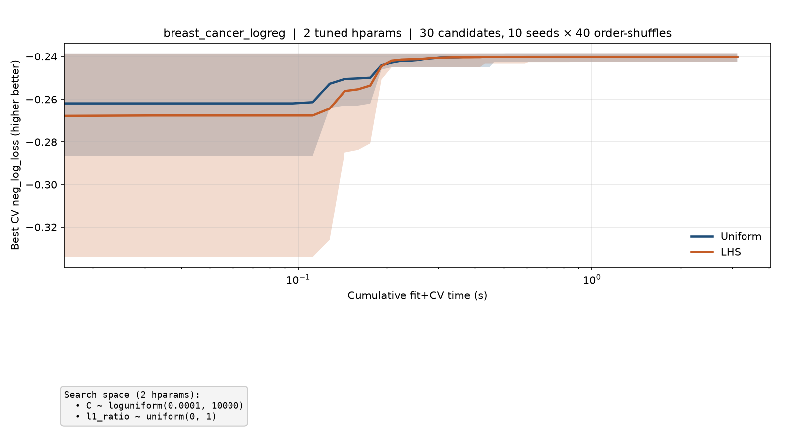
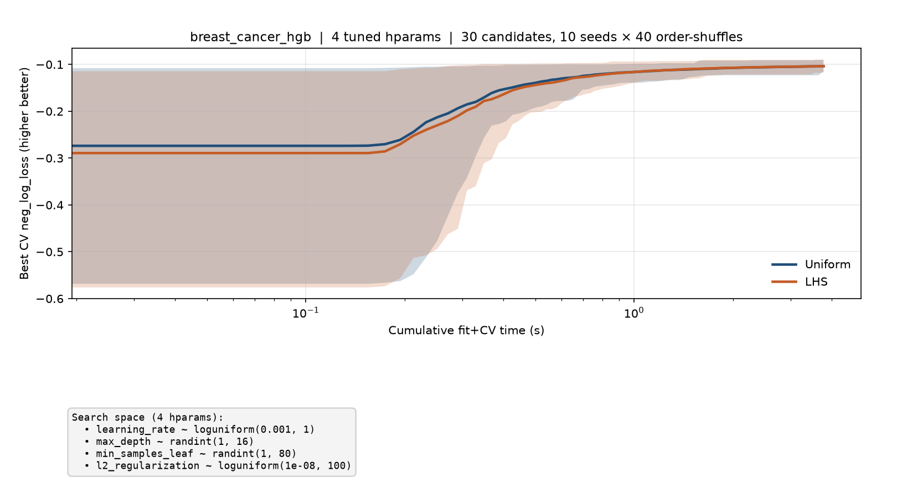
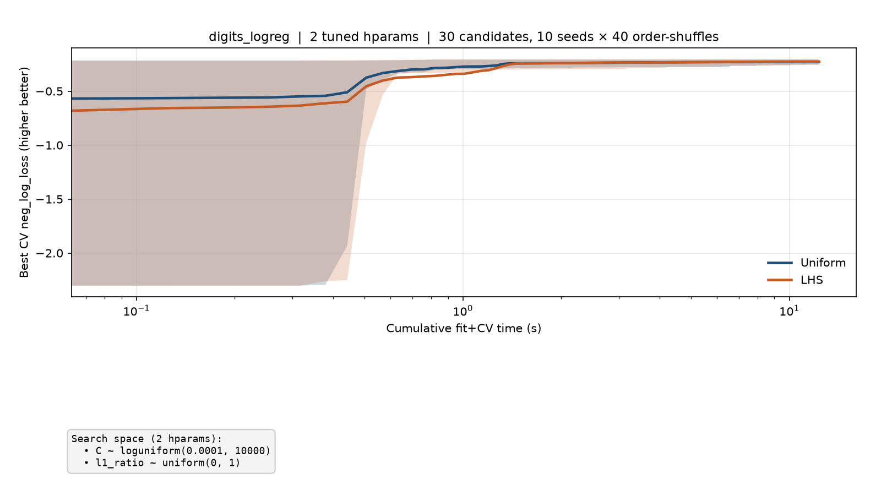
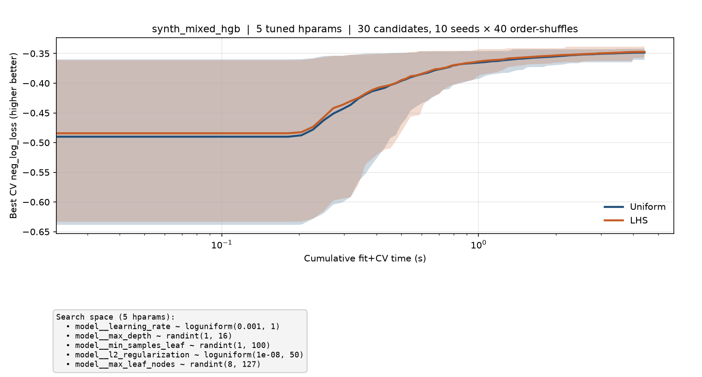
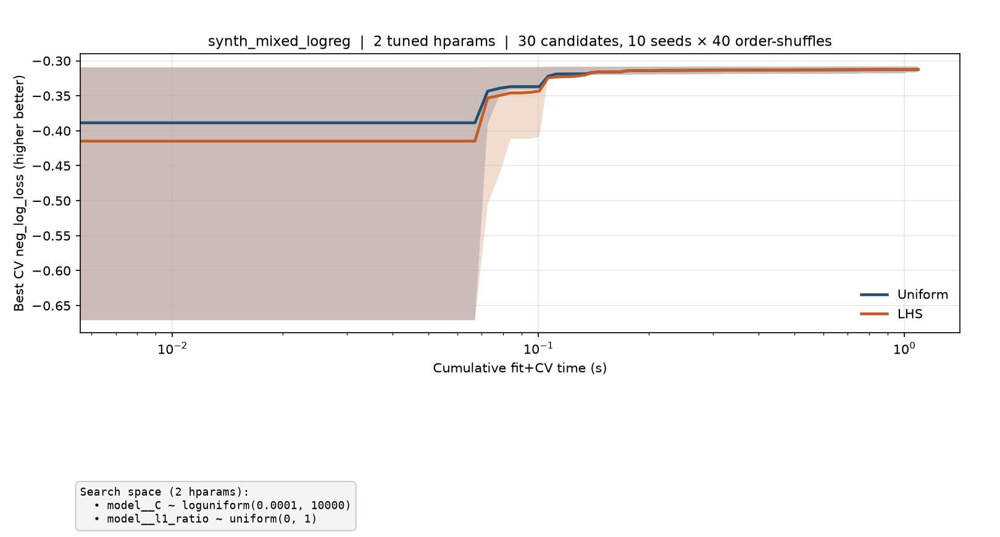
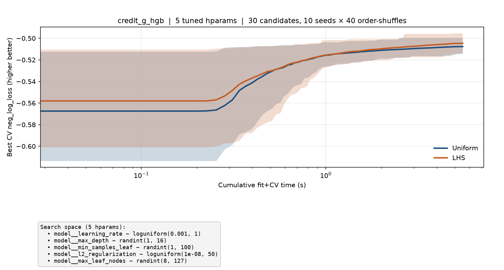

# Banded anytime Pareto plots

_Generated 2026-08-18 18:34:34 UTC_

Protocol: **30 candidates**/method/seed, **10 seeds**, **40 evaluation-order shuffles**/seed → uncertainty bands (10–90th percentile) on cumulative time vs best score so far.

Search spaces use **log-uniform** sampling for multiplicative hyperparameters (`C`, `alpha`, `learning_rate`, `l2_regularization`). Spaces were widened when best configs repeatedly hit extendable boundaries (with saturation guards for effectively unregularized `C`/`alpha` and extreme learning rates).

## `diabetes_ridge` — 1 tuned hparams



```
alpha ~ loguniform(0.0001, 10000)
```

## `diabetes_hgb` — 4 tuned hparams



```
learning_rate ~ loguniform(0.001, 1)
max_depth ~ randint(1, 16)
min_samples_leaf ~ randint(1, 80)
l2_regularization ~ loguniform(1e-08, 100)
```

## `breast_cancer_logreg` — 2 tuned hparams



```
C ~ loguniform(0.0001, 10000)
l1_ratio ~ uniform(0, 1)
```

## `breast_cancer_hgb` — 4 tuned hparams



```
learning_rate ~ loguniform(0.001, 1)
max_depth ~ randint(1, 16)
min_samples_leaf ~ randint(1, 80)
l2_regularization ~ loguniform(1e-08, 100)
```

## `digits_logreg` — 2 tuned hparams



```
C ~ loguniform(0.0001, 10000)
l1_ratio ~ uniform(0, 1)
```

## `synth_mixed_hgb` — 5 tuned hparams



```
model__learning_rate ~ loguniform(0.001, 1)
model__max_depth ~ randint(1, 16)
model__min_samples_leaf ~ randint(1, 100)
model__l2_regularization ~ loguniform(1e-08, 50)
model__max_leaf_nodes ~ randint(8, 127)
```

## `synth_mixed_logreg` — 2 tuned hparams



```
model__C ~ loguniform(0.0001, 10000)
model__l1_ratio ~ uniform(0, 1)
```

## `credit_g_hgb` — 5 tuned hparams



```
model__learning_rate ~ loguniform(0.001, 1)
model__max_depth ~ randint(1, 16)
model__min_samples_leaf ~ randint(1, 100)
model__l2_regularization ~ loguniform(1e-08, 50)
model__max_leaf_nodes ~ randint(8, 127)
```

This pull request includes code written with the assistance of AI.
The code has **not yet been reviewed** by a human.
