# Pareto / anytime plots — large sampler differences

_Generated 2026-08-18 15:53:11 UTC_

Each plot shows the **anytime Pareto curve**: best CV score so far vs
cumulative fit+CV time (left) and vs evaluation count (right).
Higher is better for all scorers used (`neg_*`).

## `diabetes_hgb`

### Mean across seeds

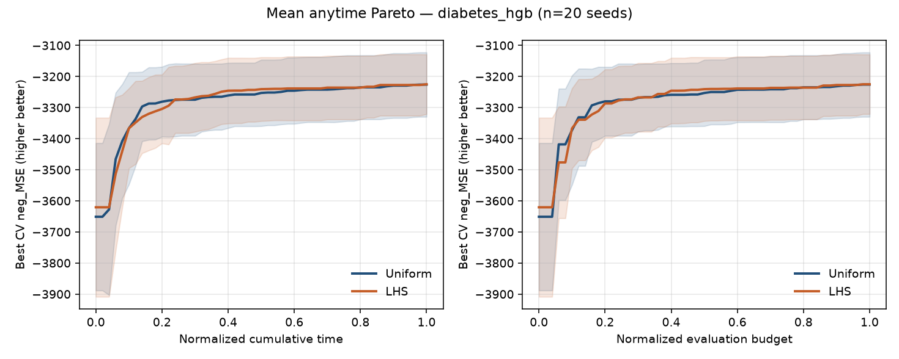

### Divergent seed 9 (max |LHS−Uniform| gap ≈ 631.2)

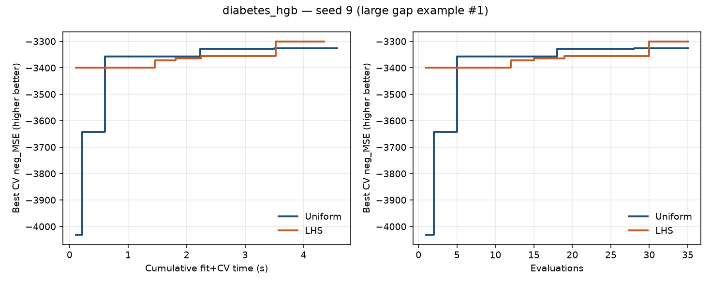

### Divergent seed 0 (max |LHS−Uniform| gap ≈ 575.6)

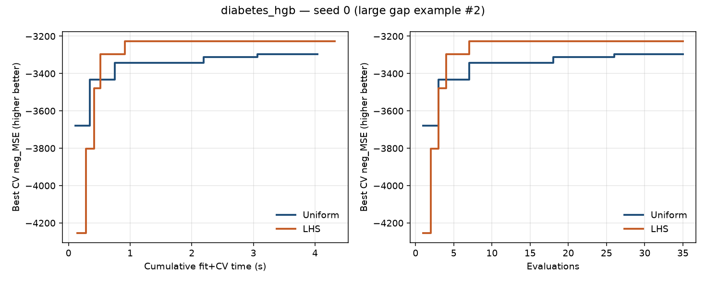

## `diabetes_ridge`

### Mean across seeds

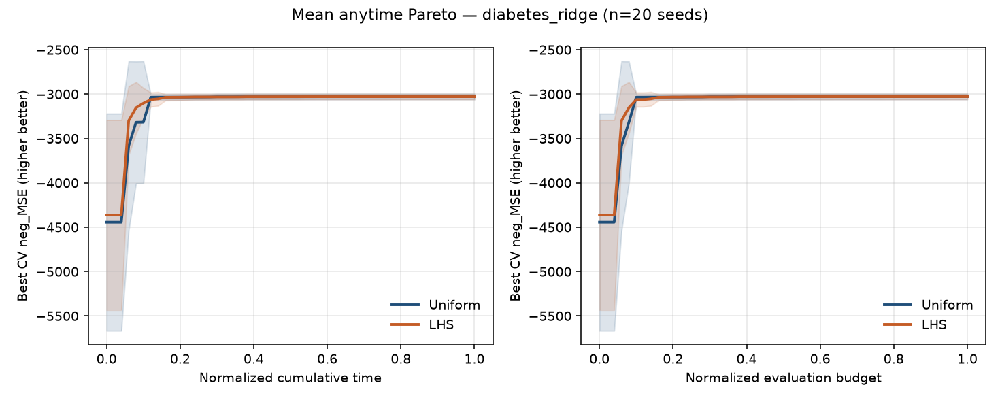

### Divergent seed 12 (max |LHS−Uniform| gap ≈ 2918)

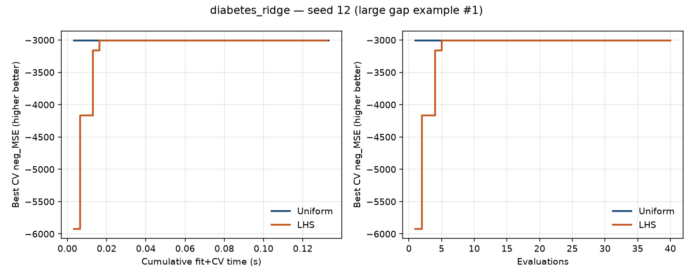

### Divergent seed 9 (max |LHS−Uniform| gap ≈ 2906)

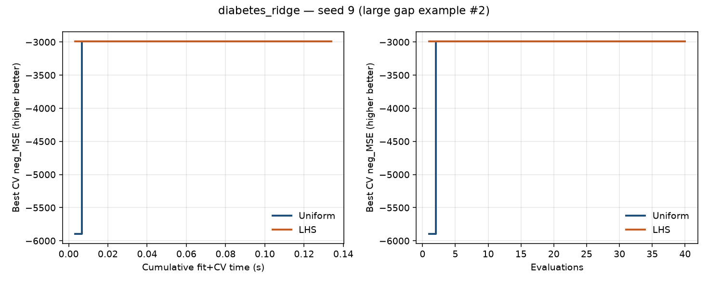

## `breast_cancer_hgb`

### Mean across seeds

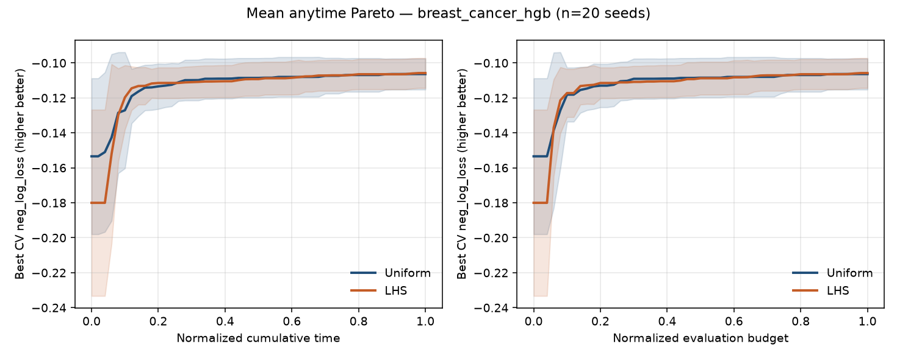

### Divergent seed 3 (max |LHS−Uniform| gap ≈ 0.1566)

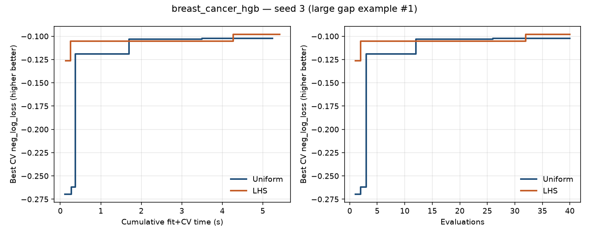

### Divergent seed 19 (max |LHS−Uniform| gap ≈ 0.1555)

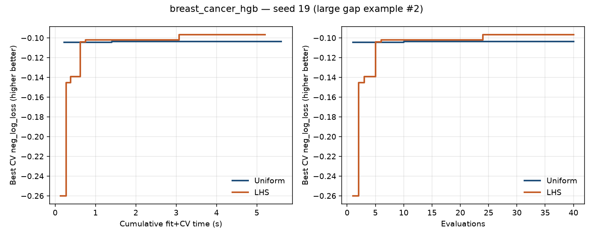

## `digits_logreg`

### Mean across seeds

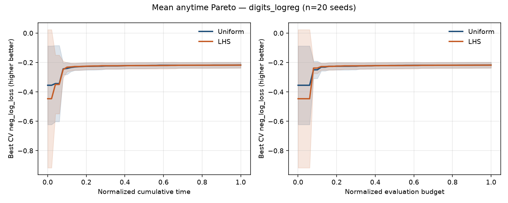

### Divergent seed 9 (max |LHS−Uniform| gap ≈ 2.096)

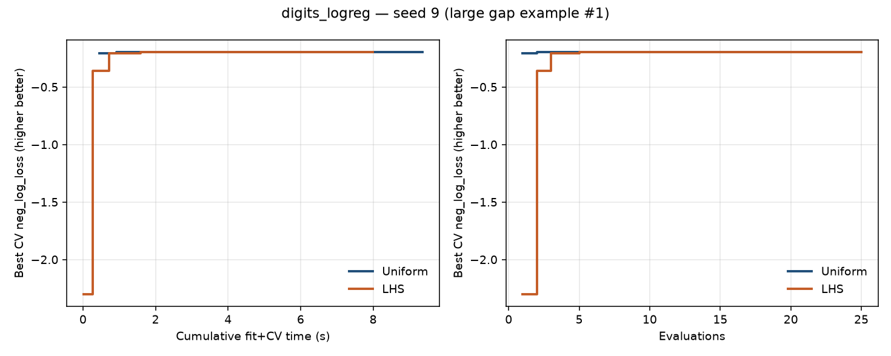

### Divergent seed 11 (max |LHS−Uniform| gap ≈ 0.9289)

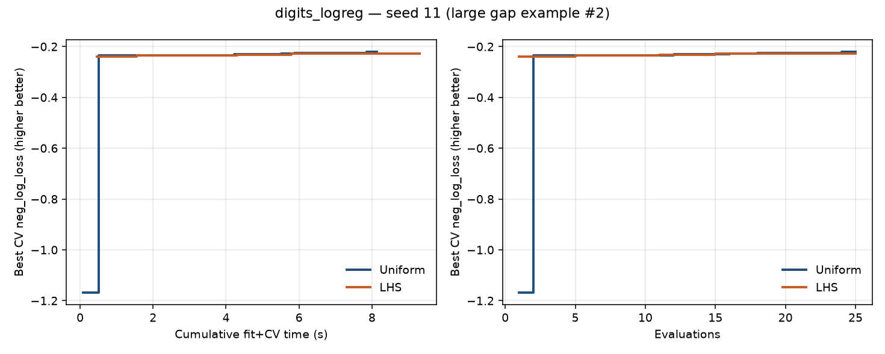

## `synth_mixed_hgb`

### Mean across seeds

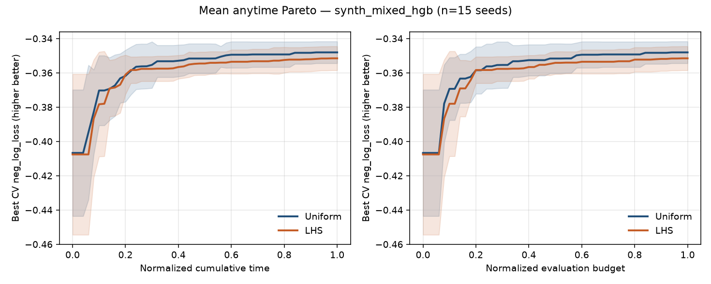

### Divergent seed 6 (max |LHS−Uniform| gap ≈ 0.1253)

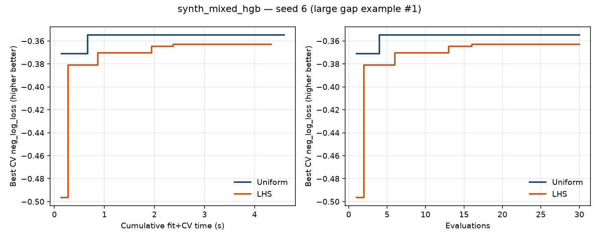

### Divergent seed 3 (max |LHS−Uniform| gap ≈ 0.1064)

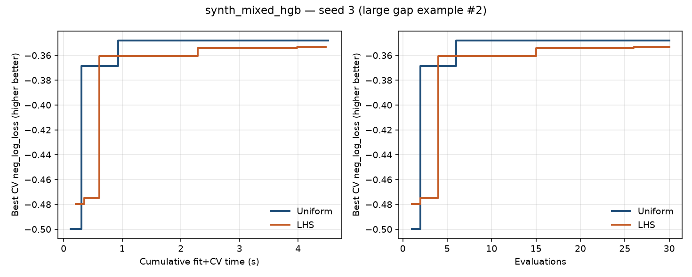

## `credit_g_hgb`

### Mean across seeds

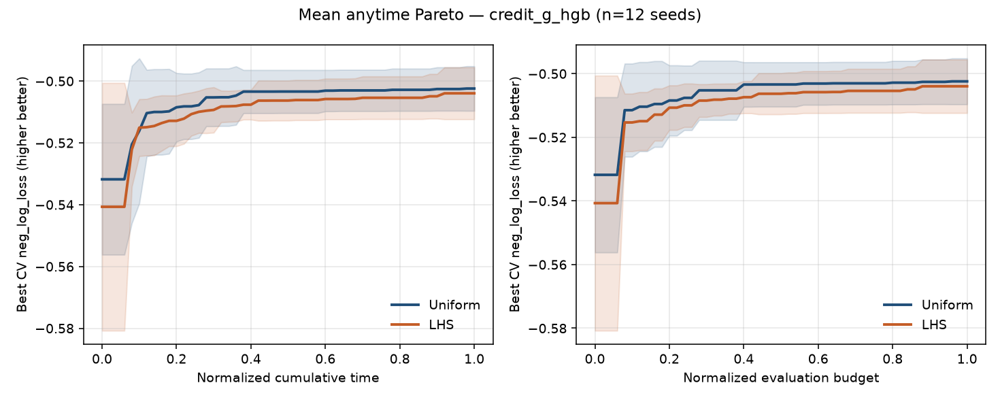

### Divergent seed 4 (max |LHS−Uniform| gap ≈ 0.08655)

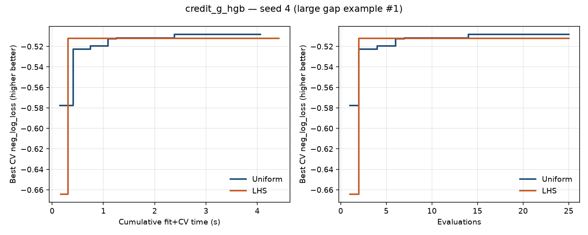

### Divergent seed 10 (max |LHS−Uniform| gap ≈ 0.04716)

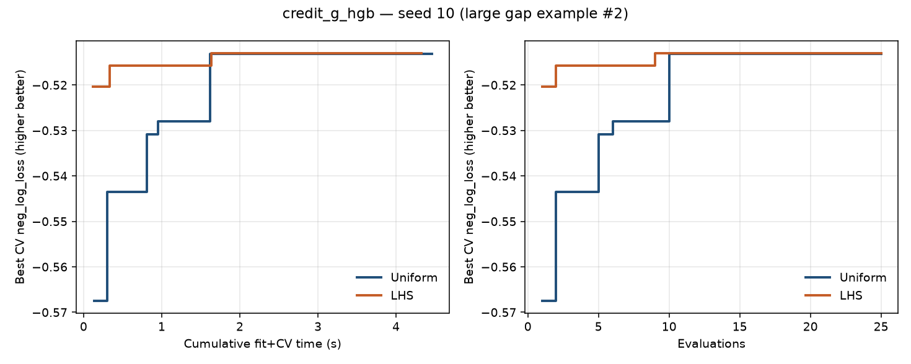

## `synth_mixed_logreg`

### Mean across seeds

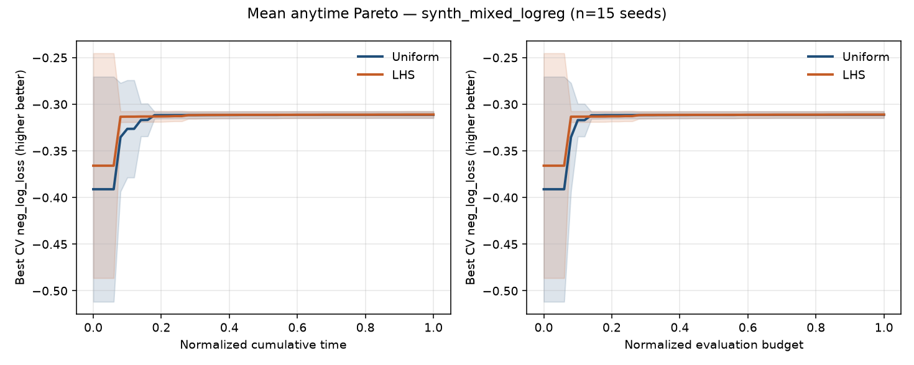

### Divergent seed 7 (max |LHS−Uniform| gap ≈ 0.3639)

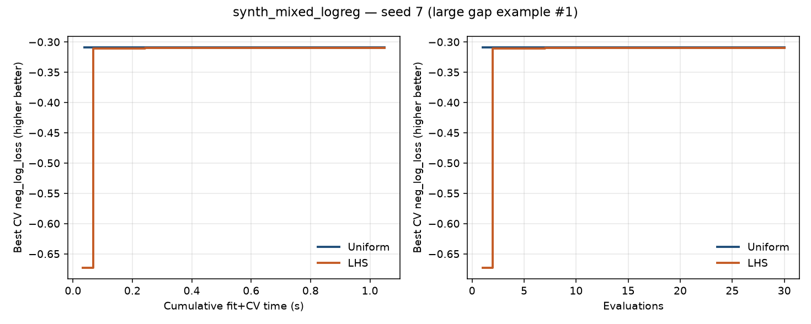

### Divergent seed 0 (max |LHS−Uniform| gap ≈ 0.3541)

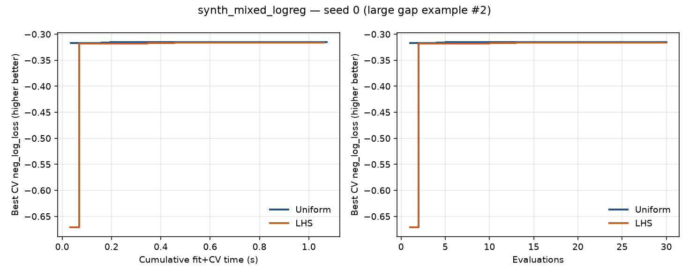

This pull request includes code written with the assistance of AI.
The code has **not yet been reviewed** by a human.
